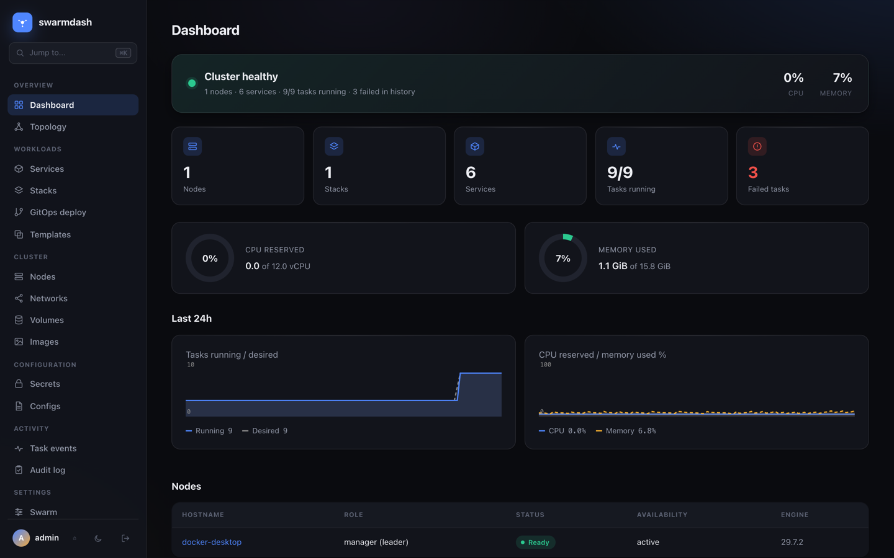
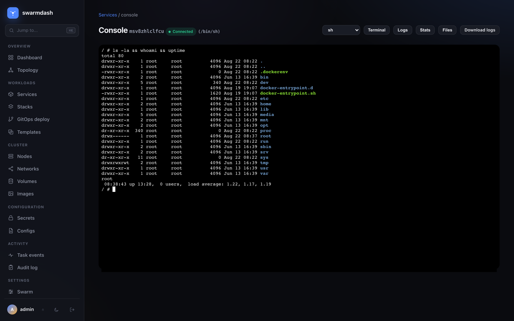
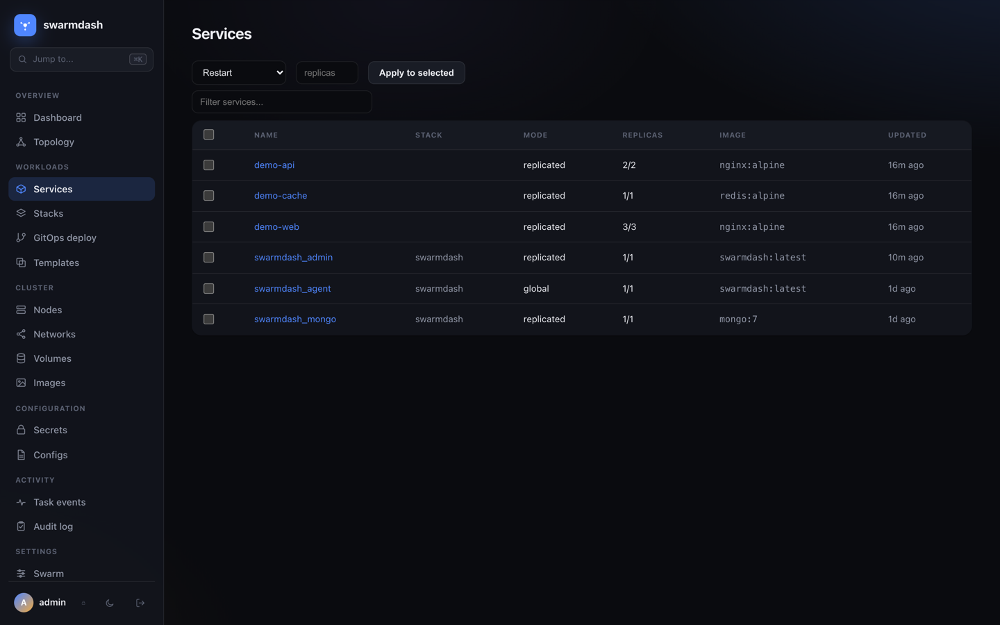
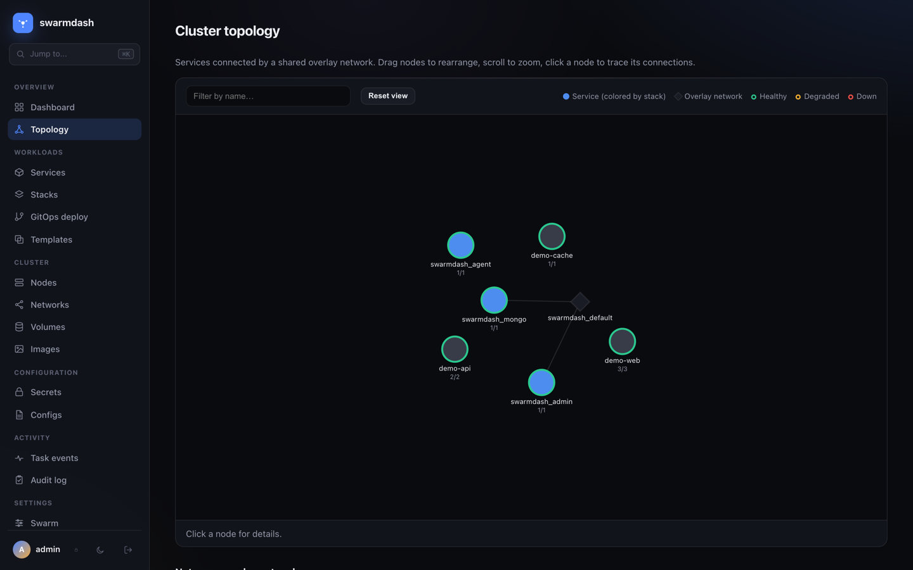
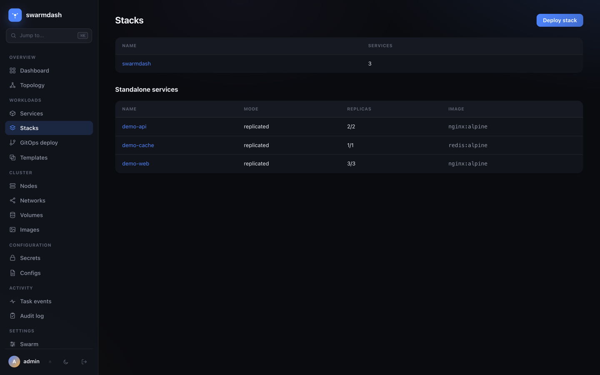
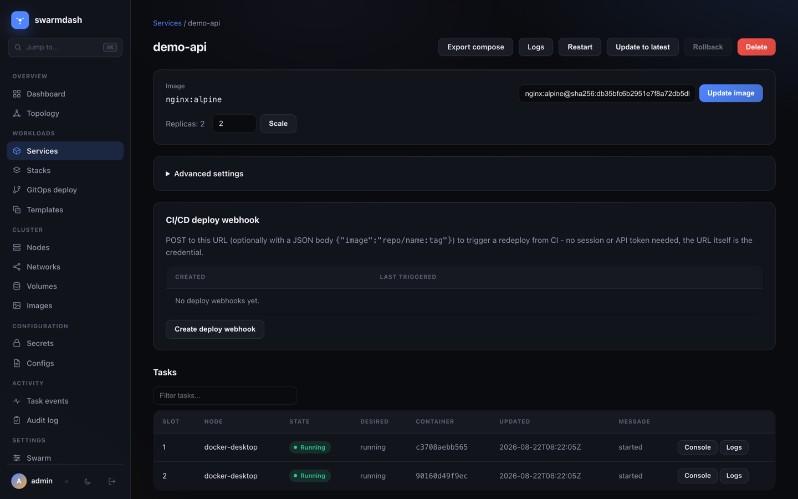
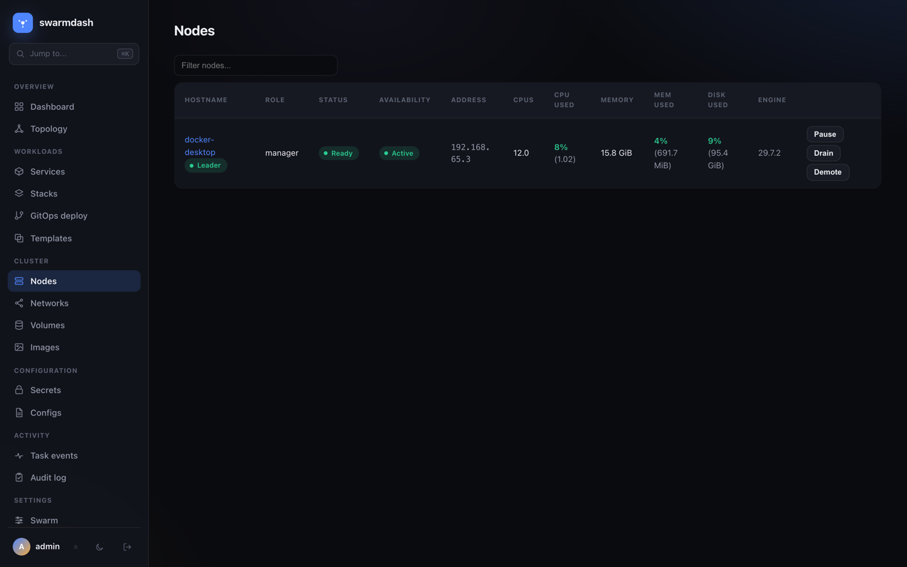

<p align="center">
  
</p>

<p align="center">
  <a href="https://github.com/MathWave/swarmdash/actions/workflows/ci.yml"></a>
  <a href="https://hub.docker.com/r/mathwave/swarmdash"></a>
  <a href="go.mod"></a>
  <a href="LICENSE"></a>
</p>

<p align="center">
  <b><a href="https://swarmdash.app">swarmdash.app</a></b> &nbsp;·&nbsp;
  <b><a href="https://hub.docker.com/r/mathwave/swarmdash">Docker Hub</a></b> &nbsp;·&nbsp;
  <b><a href="#quickstart">Quickstart</a></b> &nbsp;·&nbsp;
  <b><a href="#features">Features</a></b>
</p>

<p align="center">
  The admin panel Docker Swarm doesn't ship with — stacks, services, nodes,<br>
  a web shell into any container, live rollouts, and RBAC/SSO, in one Go binary.
</p>

<p align="center">
  
  
</p>
<p align="center">
  
  
</p>

<p align="center"><sub>More screens: <a href="#more-screenshots">stacks, service detail, nodes →</a></sub></p>

`swarmdash` is a single binary with two modes: `admin` runs on a manager
node and serves the UI; `agent` runs on every node and gives `admin` a way
to reach that node's Docker daemon for exec/logs/stats. Point it at your
swarm, get a dashboard, in under five minutes — see [Quickstart](#quickstart).

|  | swarmdash | Portainer CE | Swarmpit |
|---|---|---|---|
| Scope | Swarm only | Swarm + Kubernetes + standalone | Swarm only |
| License / cost | Apache-2.0, free | free CE / paid BE | open source, free |
| RBAC (admin/viewer roles) | ✅ free | 🔒 Business Edition only | basic |
| SSO (OIDC) | ✅ free | 🔒 Business Edition only | ❌ |
| GitOps auto-sync (poll/webhook) | ✅ free | 🔒 Business Edition only | ❌ |
| Web exec console | ✅ | ✅ | ✅ |
| Status as of writing | new, 0.x | mature, widely deployed | feature-complete, low activity |

<sub>Portainer/Swarmpit facts above are best-effort as of Aug 2026 — verify
against their own docs before deciding. swarmdash is the newest of the
three by a wide margin; weigh that against the free RBAC/SSO/GitOps.</sub>

<details>
<summary><b>Table of contents</b></summary>

- [Quickstart](#quickstart)
- [Building](#building)
- [Running locally against a test swarm](#running-locally-against-a-test-swarm)
- [Deploying on a real cluster](#deploying-on-a-real-cluster)
- [Features](#features)
- [Why the agent/admin split](#why-the-agentadmin-split)
- [More screenshots](#more-screenshots)
- [Known gaps / next steps](#known-gaps--next-steps)
- [Testing](#testing)
- [Contributing](#contributing)
- [Security](#security)
- [License](#license)

</details>

## Quickstart

On any Linux machine (installs Docker if it's missing, initializes swarm
mode if this node isn't in it yet, builds the image, deploys the stack, and
prints the panel's URL plus the generated bootstrap admin credentials):

```
git clone https://github.com/MathWave/swarmdash.git
cd swarmdash
make up
```

Already have a Docker Swarm cluster running? Skip straight to
[Deploying on a real cluster](#deploying-on-a-real-cluster) below (`make
deploy`) instead — `make up` is specifically the from-a-bare-machine path.

Want to pin the bootstrap admin password yourself instead of reading a
generated one out of the logs? Set `SWARMDASH_ADMIN_PASSWORD` in `.env`
before running `make up`/`make deploy` — see `.env.example`.

Prefer the published image over building locally? `docker pull
mathwave/swarmdash` — edit the `image:` lines in
[deploy/stack.yml](deploy/stack.yml) to `mathwave/swarmdash:latest` before
running `make deploy` (skips the local `docker build` step, useful on
multi-node clusters where you'd otherwise have to build on every node).

## Building

```
go build -o bin/swarmdash ./cmd/swarmdash
# or:
make build          # local binary
make build-linux     # linux/amd64 for the cluster
make docker          # swarmdash:dev image
```

## Running locally against a test swarm

```
docker swarm init   # if not already in swarm mode

export SWARMDASH_CLUSTER_SECRET=dev-secret
export SWARMDASH_MONGO_URI=mongodb://localhost:27017
./bin/swarmdash agent --listen :8871 &
./bin/swarmdash admin --listen :8870 &
```

`admin` needs a MongoDB instance to talk to (users, sessions, audit log,
tokens, etc. - see Hardening below); a single-node `docker run -p
27017:27017 mongo:7` is enough for local testing.

The first admin start prints a generated bootstrap password to stdout
(unless `SWARMDASH_ADMIN_PASSWORD` / `--bootstrap-password` is set; the
username is `admin` unless `SWARMDASH_ADMIN_USERNAME` / `--bootstrap-username`
is set). Open http://localhost:8870. Either way, that first login forces you
to set your own password before anything else is reachable - see
"Change password" under the user menu once you're past that.

## Deploying on a real cluster

See [deploy/stack.yml](deploy/stack.yml): `agent` runs `mode: global`
attached to the pre-existing `host` network (so it's reachable at each
node's real address — plain `network_mode: host` is silently ignored by
`docker stack deploy`, it only works for docker-compose/docker run, so the
external-network attach is the way to get real host networking for a Swarm
service), `admin` runs pinned to a manager, and a single-replica `mongo`
service (also pinned to a manager, with its own volume) backs admin's
storage — swap it for an external MongoDB deployment if you want one that's
actually HA. `admin`/`agent` mount `/var/run/docker.sock` and share the
cluster secret via a plain environment variable (`SWARMDASH_CLUSTER_SECRET`,
interpolated from a `.env` file — not a Docker secret, see the comment at
the top of `deploy/stack.yml` for the tradeoff); admin and mongo share a
MongoDB root username/password the same way, defaulting to `mongo`/
`password` since `mongo` has no `ports:` entry and is never reachable from
outside the stack's own overlay network — override
`SWARMDASH_MONGO_USERNAME`/`SWARMDASH_MONGO_PASSWORD` in `.env` if you'd
rather not rely on that.

From a manager node that's already in swarm mode, with this repo checked
out (use [`make up`](#quickstart) instead if this node isn't in swarm mode
yet, or doesn't have Docker installed at all):

```
make deploy
```

That builds the image, generates `.env` with a random cluster secret if it
doesn't already exist (`make env` on its own does just that step — see
`.env.example` for the format; MongoDB's root username/password default to
`mongo`/`password` in `deploy/stack.yml` and are left commented out, since
the bundled `mongo` service isn't reachable from outside the stack anyway),
and runs
`docker stack deploy` with those values exported into its environment
(`docker stack deploy` doesn't read `.env` itself the way `docker compose`
does). Then:

```
docker service logs -f swarmdash_admin   # grab the generated admin password
```

(skip this if you already set `SWARMDASH_ADMIN_PASSWORD` in `.env` — then
that's the password, nothing gets generated).

To rotate a value, edit `.env` by hand and run `make deploy` again — unlike
Docker secrets these aren't immutable. Deploying without the Makefile,
export them into your shell first: `set -a; . ./.env; set +a; docker stack
deploy -c deploy/stack.yml swarmdash`.

Tear it down with `make down` (leaves `.env` and the MongoDB data volume in
place, so state survives a re-deploy).

## Why the agent/admin split

`docker exec` isn't swarm-aware — it only works against the Docker daemon
that's actually running the container. A manager can see every task
cluster-wide via the Swarm API, but to open a shell in a specific container
it has to reach the node that's running it. `agent` is a thin process on
each node that does exactly that on admin's behalf, authenticated with a
shared cluster secret.

Node addressing piggybacks on Swarm itself: `admin` resolves a task's node
via `NodeInspect` and reaches its agent at `<node.Status.Addr>:8871`, the
same advertise address Swarm already uses for its own control-plane
traffic. No overlay network or service discovery layer needed.

```
 browser  <-- HTTP/WS + cookie session -->  admin (manager node)
                                              |  Docker API (stacks/services/tasks/nodes)
                                              |  Bearer <cluster secret>
                                              v
                                            agent (every node)  <-->  local Docker daemon
```

## Features

- **Stacks, services, tasks, nodes** — list/detail views, scale, update
  image, rollback, force restart, bulk actions, placement constraints.
- **Deploy from compose**, with a dry-run preview, a template gallery, and
  GitOps (point a stack at a git repo/branch and it stays in sync).
- **Web-based console** per task — exec shell (full TTY), live logs, live
  `docker stats`, a file browser, all proxied to the right node.
- **Live rollout view**, cluster topology graph, dashboard history, and a
  public unauthenticated `/status` page for uptime monitors.
- **Users & roles, SSO (OIDC)**, API tokens, audit log of every mutating
  action, CI/CD deploy webhooks.
- **Hardening, all opt-in**: mTLS between admin and agent, HTTPS for the
  UI, encrypted registry credentials, backup/restore.

<details>
<summary><b>Full feature list</b></summary>

### Core
- Stacks / services / tasks / nodes: list + detail views.
- Service actions: scale, update image, force restart, rollback (Docker's
  native `Rollback: "previous"`), delete, plus an "advanced settings" editor
  for env vars, labels, mounts, placement constraints, CPU/memory
  limits/reservations, restart policy, and rolling-update policy
  (parallelism/delay/order/failure-action).
- Stack delete (removes every service with that stack label — Docker has
  no atomic stack-delete API) and stack-wide force-restart.
- **Deploy a stack from a compose file** (Stacks → Deploy stack): a
  pragmatic subset of the compose format — image, command, environment,
  labels, ports, volumes (short syntax), networks, deploy.replicas/mode/
  placement/resources/update_config/restart_policy. No `build:` (Swarm
  can't build images anyway), no local bind-mount resolution. Secrets/
  configs must already exist and are referenced with `external: true` —
  swarmdash never lets compose file content create a secret's value.
- Export any service, or a whole stack, back to compose YAML.
- **Dry-run preview** for compose deploys (Stacks → Deploy stack →
  Preview): shows create/update/unchanged per service and what would
  change (image, env, replicas, mounts, resources) before anything is
  touched.
- **Template gallery** (Stacks → Templates): built-in compose templates
  for common self-hosted services (Postgres, MySQL, Redis, MongoDB, nginx,
  Adminer) — "Use template" pre-fills the deploy form, same preview/submit
  flow as pasting compose by hand.
- **GitOps stack deploy** (Stacks → GitOps deploy): point a stack at a git
  repo/branch/compose path instead of pasting YAML. "Sync now" or a poll
  interval (1–60 min) re-fetches the compose file and re-applies it
  whenever the commit at that ref changes. Uses a pure-Go git client (no
  system `git` binary), optionally with an HTTPS access token for private
  repos (encrypted at rest, same as registry passwords).
- **CI/CD deploy webhooks** (on a service's detail page): mint a
  per-service webhook URL a CI pipeline can `POST` to (optionally with
  `{"image": "repo/name:tag"}`) to force a redeploy — no session or API
  token needed, the token in the URL is the credential. Only its hash is
  stored; the URL is shown once at creation, same convention as API
  tokens.
- **Bulk operations**: select multiple services on the Services page and
  restart/scale/delete them in one action.
- **Placement preferences** (spread over a label, e.g.
  `node.labels.zone`) alongside placement constraints, in both the
  service editor and compose deploy.
- **Node labels**: add/remove custom labels on a node's detail page
  (`/nodes/{id}`) for use in placement constraints/preferences.
- **Volumes**: per-node list/create/delete, same pattern as images (both
  are local to each node's daemon, not swarm-wide).
- **Swarm settings** (Settings → Swarm): cluster info, cert expiry, and
  the worker/manager join tokens with one-click rotation.
- **Rebalance** (Settings → Swarm): force-restarts every replicated
  service so Swarm re-places their tasks across all current nodes — useful
  after adding/removing nodes, since Swarm only weighs node load for *new*
  task placement and never moves an already-running task on its own.
  Global-mode services are skipped (already one task per eligible node
  automatically).
- Live rollout view: service detail page streams task state over SSE,
  polling the Docker API every 1.5s (Docker doesn't push task-state
  changes, so this mirrors what `docker service ps --watch` effectively
  does).
- Web-based console: exec a shell in any running task's container
  (xterm.js, full TTY + resize), live log tail, live `docker stats`, a
  directory browser + file download, and a log-file download — all
  proxied through admin to the right node's agent, with the browser-facing
  websockets auto-reconnecting on drop.
- Networks / Secrets / Configs: list, create, delete.
- Node actions: activate / pause / drain, promote / demote.
- Images: per-node list + prune (dangling, or `all` for every unused
  image), since images live on each node's daemon rather than swarm-wide.
- Registry credentials: stored encrypted (AES-256-GCM, keyed off the
  cluster secret) and applied automatically to service create/update/
  compose-deploy when the image's registry matches one you've configured.
- Audit log of every mutating action (who, what, when, success/failure).
- API tokens (Settings → API tokens) for CI/CD: `Authorization: Bearer
  <token>` works on every endpoint alongside the browser session cookie.
- Sortable/filterable tables (client-side, no reload) on the services,
  nodes, and per-service task lists.
- Auth: user store in MongoDB (see below), bcrypt passwords, session
  cookies. First run bootstraps an `admin` user.
- **Users & roles** (Settings → Users): create additional accounts with
  role `admin` (full access) or `viewer` (read-only - no mutating
  actions, no console access, Settings pages hidden/blocked). API tokens
  (above) carry the same role; tokens created before roles existed have
  no stored role and are treated as `admin`. Enforced in one place
  (`requireRole` in `internal/admin/auth.go`, wrapped around every
  protected route) rather than per-handler, so no route can be missed.
  Guard rails: you can't delete your own account or the last remaining
  admin.
- **Single sign-on** (Settings → SSO): generic OIDC (Authorization Code +
  PKCE against any provider that publishes a
  `/.well-known/openid-configuration` document - Okta, Authentik, Keycloak,
  Google Workspace, Azure AD, Auth0, ...). Local username/password login
  stays available alongside it by default. Accounts can auto-provision on
  first login (with a configurable default role and an optional
  email-domain allowlist) or be pre-created from Settings → Users as an
  "SSO account" with no local password. An "Require SSO" switch on the
  same page turns local login off entirely - both the form on `/login`
  and `POST /login` itself, not just a hidden button - leaving the "Sign
  in with ..." button as the only way in; see Known gaps for the lockout
  risk that comes with it. Not SAML - see Known gaps.
- **Backup & restore** (Settings → Backup): download users, roles, API
  tokens, webhooks, registry credentials, GitOps stacks and SSO config as
  one JSON file; restore merges it back in (creates/overwrites by ID,
  never deletes). Deliberately scoped to configuration, not history - the
  audit log and metrics samples aren't included. Encrypted fields
  (registry passwords, GitOps tokens, the SSO client secret) travel as
  ciphertext and only decrypt again on an admin instance using the same
  `--cluster-secret` the backup was taken with; restore flags anything it
  can't decrypt instead of silently importing it.

### Observability
- A background poller (every 10s - Docker doesn't push any of this, same
  reasoning as the SSE rollout view) watches for:
  - **Task state transitions** → durable history at Task events (`/events`,
    filterable by service), so "what happened at 3am" has an answer after
    the live view has moved on.
  - **Services stuck below their desired replica count for 2+ minutes**
    and **nodes going down/recovering** → fire configured **alert
    webhooks** (Settings → Webhooks: name + URL, POSTed a JSON
    `{event, target, message, time}` body) and record an entry in the
    audit log either way.
- **Metrics sparklines**: the console's Stats tab renders live CPU%/
  memory% line charts (plain `<canvas>`, no charting library) computed
  from the same stats stream already used for the raw JSON view.
- **Dashboard history**: the same poller samples cluster-wide task/service/
  node health and CPU/memory *reservation* (what the scheduler accounts
  against node capacity, not live per-container usage — that would need a
  cluster-wide stats collector, a bigger separate feature) roughly once a
  minute, kept for 14 days. The dashboard's "Last 24h" section renders it
  as plain-canvas line charts, same convention as the console sparklines.
- **Public status page** at `/status` — deliberately unauthenticated (for
  uptime monitors / status pages) and deliberately minimal: aggregate
  node/service counts only, nothing that identifies specific
  nodes/images/services by name.

### Always on
- **CSRF protection**: every mutating request from a browser session must
  echo back a per-browser token (double-submit cookie), checked in one
  place (`security` middleware in `internal/admin/security.go`) wrapped
  around the whole app, not per-handler. Plain `<form method="post">`
  elements get the token injected automatically by `app.js` from a
  `<meta>` tag - page templates don't wire it up individually. API tokens
  (bearer auth) and the CI deploy-hook endpoint are exempt: neither relies
  on a browser cookie, so neither can be forged cross-site the way this
  protects against.
- **Security headers** on every response: `X-Content-Type-Options: nosniff`,
  `X-Frame-Options: DENY`, `Referrer-Policy: same-origin`,
  `Permissions-Policy` (denies geolocation/camera/mic/etc, all unused),
  `Strict-Transport-Security` when serving over TLS, and a
  `Content-Security-Policy` scoped to the app's own same-origin assets
  (`default-src 'self'`) with per-response nonces allow-listing the
  handful of inline `<script>` blocks that render server-side chart/graph
  data, instead of blanket-allowing inline script.
- **`GET /health`**: unauthenticated liveness/readiness probe for a Docker
  `HEALTHCHECK`, a Swarm service healthcheck, or an external uptime
  check. Unlike `/status` it actually exercises MongoDB and the local
  Docker daemon (`200` + `{"status":"ok",...}`, or `503` naming whichever
  dependency failed) rather than just confirming the HTTP server accepts
  connections.
- **Login lockout**: 5 failed local-password attempts for a username within
  15 minutes locks it out for 15 minutes, tracked in MongoDB so it holds
  regardless of which admin replica a guess lands on. Applies to unknown
  usernames too, so it doesn't double as a way to enumerate valid accounts.

### Hardening (all opt-in)
- mTLS between admin and agent: `swarmdash tls init` (or `make tls`)
  generates a CA plus a shared agent server cert and admin client cert;
  point `--tls-cert/--tls-key/--tls-ca` (agent) and `--agent-tls-cert/
  --agent-tls-key/--agent-tls-ca` (admin) at them. Off by default — the
  cluster-secret bearer auth is enough on a trusted cluster network.
  Leaf certs are valid for 1y; renew them before they expire with
  `swarmdash tls renew` (or `make tls-renew`), which reissues agent/admin
  certs from the existing CA without touching the CA itself, so already-
  distributed `ca.crt` copies stay valid. Only re-run `tls init` for a new
  cluster — it mints a brand new CA and invalidates every certificate
  issued from the old one.
- HTTPS for the admin UI itself: `--ui-tls-cert`/`--ui-tls-key`.
- Storage: all admin state (users, sessions, audit log, tokens, registry
  credentials, gitops stacks, ...) lives in MongoDB. Either set
  `--mongo-uri`/`SWARMDASH_MONGO_URI` directly (`_FILE` suffix also works,
  Docker-secret style), or leave it unset and configure the discrete parts
  it's built from instead — `--mongo-host`/`SWARMDASH_MONGO_HOST` (default
  `localhost`), `--mongo-port`/`SWARMDASH_MONGO_PORT` (default `27017`),
  `--mongo-username`/`SWARMDASH_MONGO_USERNAME`, `--mongo-password`/
  `SWARMDASH_MONGO_PASSWORD` (username/password both support the `_FILE`
  convention, so each can be its own Docker secret), `--mongo-auth-source`/
  `SWARMDASH_MONGO_AUTH_SOURCE` (defaults to `admin` once a username is
  set), and `--mongo-params`/`SWARMDASH_MONGO_PARAMS` for anything else
  (e.g. `replicaSet=rs0`). `--mongo-database`/`SWARMDASH_MONGO_DATABASE`
  (defaults to `swarmdash`) selects the working database either way. See
  [deploy/stack.yml](deploy/stack.yml) for the discrete-parts form in
  practice. Because state isn't pinned to a single admin container's local
  disk, running more than one admin replica for HA is just a matter of
  raising `deploy.replicas` — every replica talks to the same MongoDB
  deployment. Point all replicas at a MongoDB replica set (not a single
  standalone node) if you actually want MongoDB itself to be HA too.

</details>

## More screenshots

<p align="center">
  
  
  
</p>

## Known gaps / next steps

<details>
<summary>Expand — multi-cluster, SSO caveats, and more</summary>

- **Multi-cluster** — one admin instance manages exactly one swarm; running
  against several clusters means running several admin instances.
- The degraded-service/node-down poller state (and its 2-minute alert
  threshold) lives in memory and resets on admin restart - a restart
  during an ongoing incident means one missed/delayed alert, not a false
  one (task event history in MongoDB is unaffected).
- GitOps auto-poll last-checked timestamps are in-memory too (same
  reasoning) — a restart just delays the next check by up to the poller's
  30s tick, it doesn't skip or repeat a deploy.
- Deploy webhooks are unauthenticated by design (the token in the URL is
  the credential, matching GitHub/GitLab/Portainer's model) — anyone who
  obtains the URL can force a redeploy of that one service. Treat it like
  any other CI secret.
- SSO is OIDC-only — no SAML. Covers every major IdP (Okta, Authentik,
  Keycloak, Google Workspace, Azure AD, Auth0, ...) since they all speak
  OIDC, but a shop standardized on SAML-only (e.g. some ADFS setups) can't
  point it at swarmdash directly.
- "Require SSO" (Settings → SSO) has no built-in break-glass: once it's
  on, local password login is rejected server-side with no override flag
  or recovery user. If the identity provider is unreachable or
  misconfigured afterwards, every account is locked out until an operator
  flips `enforce_sso` back to `false` directly in the `sso_config`
  collection in MongoDB. Verify SSO sign-in actually works before turning
  this on.
- `/health` checks MongoDB and the local Docker daemon, not connectivity
  to any particular agent — an admin instance can report healthy while one
  node's agent is unreachable (that surfaces in the UI as a failed
  exec/logs/stats proxy to that node, not as a failed health probe).
- Backup/restore covers configuration only, not audit log or metrics
  history, and restore is additive (upsert) rather than a full
  point-in-time rollback — it can't undo a deletion made after the backup
  was taken.

</details>

## Testing

```
go test ./... -cover
```

Unit tests cover the pure logic: compose file parsing/diff/export, the
registry-credential encryption, pagination, mTLS CA/cert generation, and
secret-env resolution. `internal/admin`'s HTTP handlers, `internal/agent`,
and `cmd/swarmdash` talk to a real Docker daemon and MongoDB, so those are
exercised by running the real thing (`make up`) rather than mocked.

CI ([.github/workflows/ci.yml](.github/workflows/ci.yml)) runs the above
plus `gofmt -l`, `go vet`, and
[golangci-lint](https://github.com/golangci/golangci-lint) on every push and
PR, and a non-blocking [`govulncheck`](https://pkg.go.dev/golang.org/x/vuln/cmd/govulncheck)
scan of dependencies (see the workflow for why it's informational rather
than a hard gate right now). Dependabot keeps Go modules, GitHub Actions,
and the Dockerfile's base images on weekly update PRs.

## Contributing

See [CONTRIBUTING.md](CONTRIBUTING.md). Bug reports and feature requests:
[open an issue](https://github.com/MathWave/swarmdash/issues). This project
follows the [Code of Conduct](CODE_OF_CONDUCT.md).

## Security

See [SECURITY.md](SECURITY.md) for how to report a vulnerability privately.

## License

[Apache License 2.0](LICENSE). See [NOTICE](NOTICE) for bundled
third-party JS attributions.
